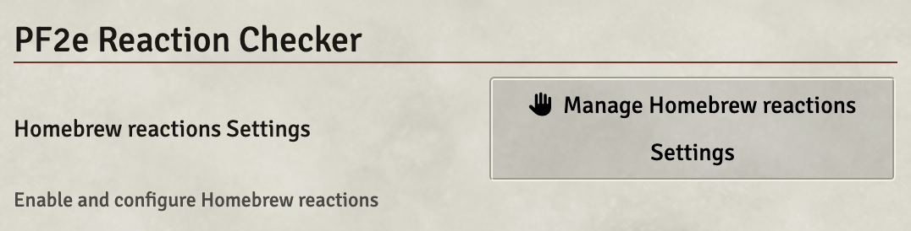
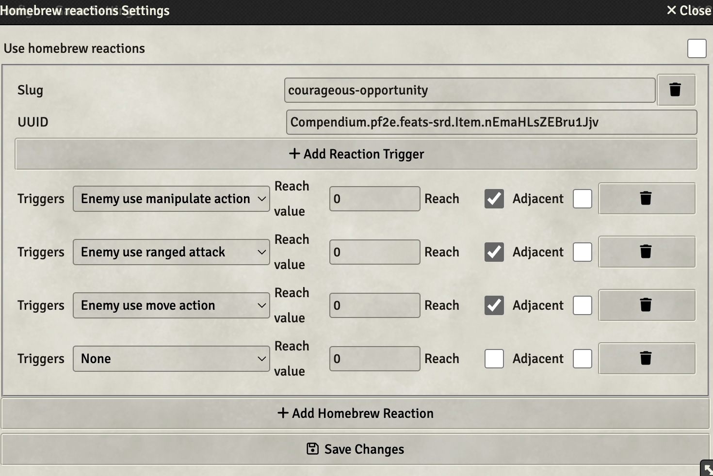
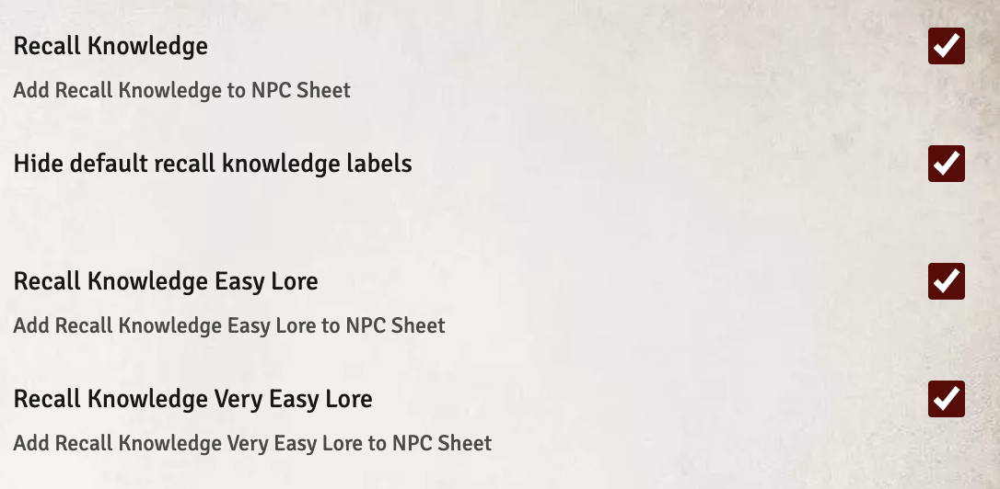
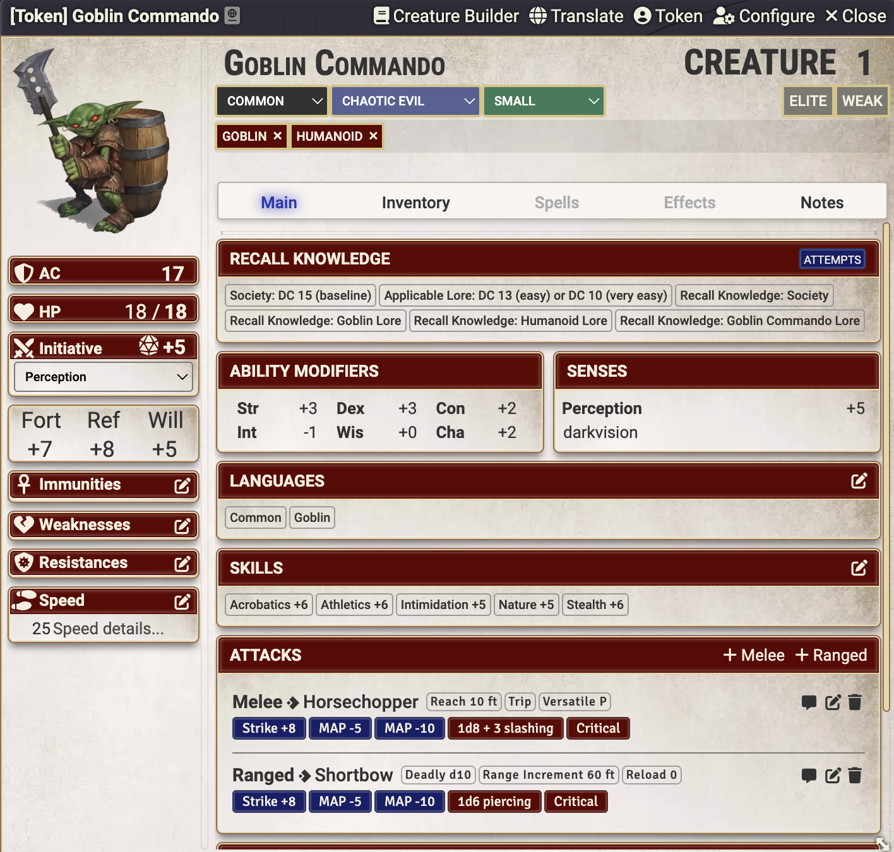

# PF2e Reaction Checker

[![Version]][Version URL]

[![Forge Installs ULR]][Forge Installs Download]

[Support me on Patreon](https://www.patreon.com/reyzor1991)

Module to notify that actor can use reaction:

### Reactions:
See [REACTIONS.md](./REACTIONS.md)

### Grouping messages

### Homebrew reactions

### Multiple reactions feature
- Triple Opportunity
- Combat Reflexes
- Reflexive Riposte
- Inexhaustible Countermoves
- Quick Shield Block

### Notification:
#### Need to turn on in settings
1. Nimble Dodge
2. Airy Step
3. Pirouette
4. Farabellus Flip

### Recall Knowledge:
#### Need to turn on in settings.

### Add Recall Knowledge feature. Labels for standard identification DCs based on creature type and easy and very easy DC based on specific lore

### Issues:
1. Nimble Dodge spam notification with area spell
2. Reaction with Frequency once per day not handle correctly

If you need to add a new feature, or you find issues, you can also reach me directly via email at mishabudjakov@gmail.com or on Discord at Reyzor1991#6258.

## Patch Notes

See [CHANGELOG.md](./CHANGELOG.md)

### Next Feature:

See [NEXT_FEATURE.md](./NEXT_FEATURE.md)

### Contributing
See [CONTRIBUTING.md](CONTRIBUTING.md) and [CONTRIBUTORS.md](CONTRIBUTORS.md)

### Licenses

This module uses trademarks and/or copyrights owned by Paizo Inc., used
under [Paizo's Community Use Policy](https://paizo.com/community/communityuse). We are expressly prohibited from
charging you to use or access this content. This module is not published, endorsed, or specifically approved by Paizo.
For more information about Paizo Inc. and Paizo products, visit [paizo.com](paizo.com).

Open Game License:

* See [OpenGameLicense.md](OpenGameLicense.md)

[Version]: https://img.shields.io/badge/Version-0.2.63-yellow?style=flat-square
[Version URL]: https://github.com/reyzor1991/foundry-vtt-pf2e-reaction

[Forge Installs ULR]: https://img.shields.io/badge/dynamic/json?label=Forge%20Installs&query=package.installs&suffix=%25&url=https%3A%2F%2Fforge-vtt.com%2Fapi%2Fbazaar%2Fpackage%2Fpf2e-reaction&colorB=4aa94a
[Forge Installs Download]: https://forge-vtt.com/bazaar#package=pf2e-reaction